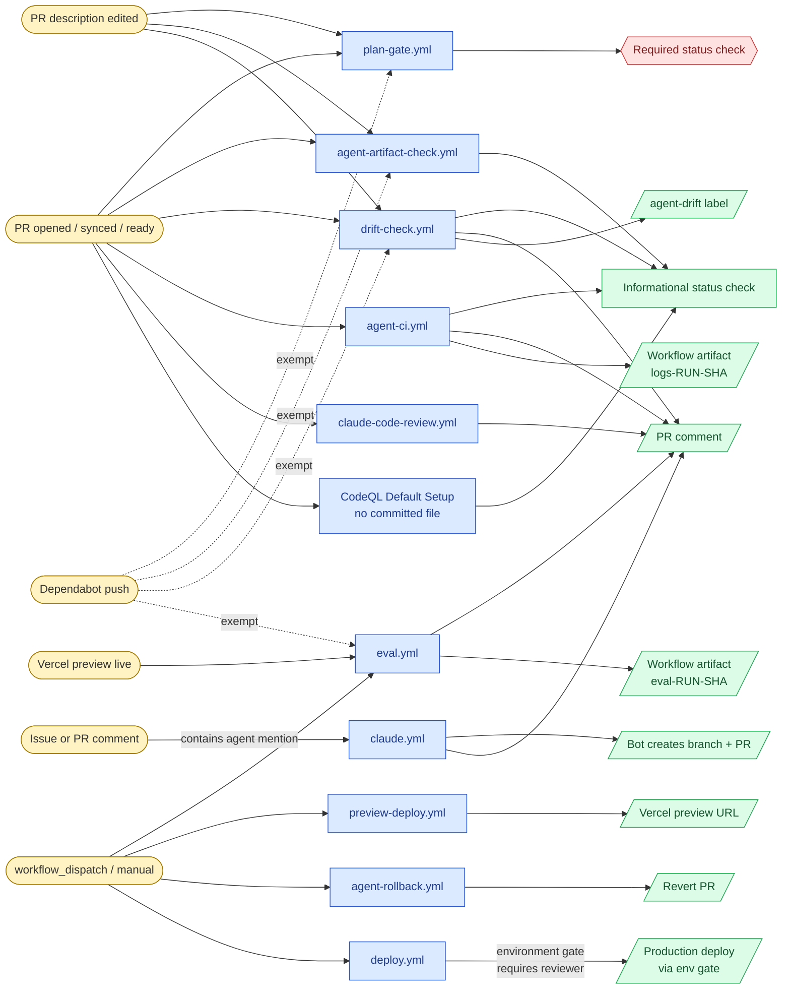
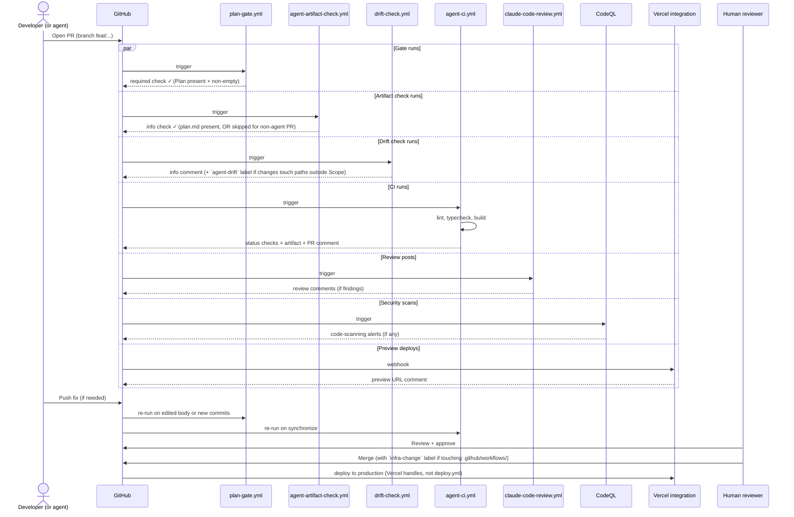

# Workflows reference

Visual map of every GitHub Actions workflow in this repo. Use this to understand what fires when, what gates merges, and how the agentic SDLC fits together.

If you're new to the repo, start with the "At a glance" flowchart, then read the per-workflow table for the specific workflow you care about.

## At a glance — triggers → workflows → outcomes

## A typical PR's lifecycle

The sequence below describes the happy-path flow when a developer (or `@claude`/`@copilot`) opens a PR against `main`.

## Workflow-by-workflow

| Workflow | Trigger | Permissions | What it produces | Required check? |
| --- | --- | --- | --- | --- |
| `plan-gate.yml` | PR `opened`, `edited`, `synchronize`, `reopened`, `ready_for_review` (excludes `dependabot[bot]` via `if:`) | `contents: read`, `pull-requests: read` | Status check validating the `## Plan (required)` section exists with non-empty Goal + at least one Step | ✅ Required (configured in `protect-main` ruleset) |
| `agent-artifact-check.yml` | PR `opened`, `synchronize`, `reopened`, `ready_for_review`, `edited`, `labeled`, `unlabeled` + `workflow_dispatch` (manual re-check with `pr_number` input). Skips for `dependabot[bot]` and for PRs that are neither on a `claude/**`/`agent/**` branch nor labeled `agent-task`. | `contents: read`, `pull-requests: read` | Informational status check verifying an agent-shaped PR adds or references a `docs/agent-tasks/<task-id>/plan.md` file (see `docs/MEMORY_POLICY.md`) | Informational on day one — promote to required only after a few green runs on real agent PRs |
| `drift-check.yml` | PR `opened`, `synchronize`, `reopened`, `ready_for_review`, `edited` + `workflow_dispatch` (manual re-check with `pr_number` input). Skips for `dependabot[bot]`. | Read-only `check` job: `contents: read`, `pull-requests: read`. Write-elevated `report` job: `contents: read`, `pull-requests: write`, `issues: write` (the labels API lives under issues). | Find-or-update PR comment listing files touched outside the plan's `- **Scope (paths/files):**` block; toggles the `agent-drift` label. Always exits 0. | Informational on day one — never fails the run; promote to required only after a few real PRs show the signal is reliable |
| `eval.yml` | `deployment_status` events where `deployment.environment == 'Preview'` and `state == 'success'` (i.e. the Vercel preview is live), plus `workflow_dispatch` with a `pr_number` input for manual re-runs / backfills. Skips for Dependabot PRs (author lookup), for production deployment_status events, and for non-success states. | Workflow baseline `contents: read`. `resolve` job adds `pull-requests: read` for PR/deployment lookups. `summary` job elevates to `pull-requests: write` only — comment-write scope is per-job, not workflow-wide. | Find-or-update PR comment with marker `<!-- eval:scorecard -->` containing the four-tool scorecard table (Lighthouse, axe-core, lychee, type-coverage). Consolidated artifact `eval-<run-id>-<sha>` (90-day retention) bundling `lighthouseci/`, `axe.json`, `lychee.json`, `type-coverage.txt`; per-tool intermediates `eval-<tool>-<run-id>-<sha>` (14-day retention) re-uploaded into the consolidated artifact by the summary job. Always exits 0. | Informational — thresholds, the qual fidelity checklist, and the promotion path documented in [`EVAL.md`](EVAL.md) |
| `agent-ci.yml` | PR `opened` / `synchronize` on `agent/**` and `feat/**` branches | `contents: read`, `pull-requests: write` | Lint, typecheck, build status checks; PR comment summary; uploaded artifact named `logs-<run-id>-<sha>` | Informational (could be made required via ruleset) |
| `claude.yml` | Agent mention (currently the trigger string is `@claude`) in issue body/title, issue comment, PR comment, or PR review | `contents: write`, `pull-requests: write`, `issues: write`, `id-token: write`, `actions: read` | Agent runs the requested task in a runner; commits to a branch; opens/updates a PR; posts a status comment on the originating issue/PR | n/a (not a status check) |
| `claude-code-review.yml` | PR `opened`, `synchronize`, `reopened`, `ready_for_review` | `contents: read`, `pull-requests: read`, `issues: read`, `id-token: write` | Posts review comments from the official `code-review` plugin | Informational (review comments) |
| `preview-deploy.yml` | `workflow_dispatch` only | least-privilege per step | Manually-triggered Vercel preview deploy. Real previews come from the Vercel GitHub integration; this workflow exists as a documented reference shape. | n/a |
| `agent-rollback.yml` | `workflow_dispatch` only — inputs: `sha` (40-char hex, validated), `reason` (string) | `contents: write`, `pull-requests: write` (per-job; baseline is `contents: read`) | Creates `revert/<short-sha>` branch + revert commit + PR with a Plan section so it can pass `plan-gate` on the way back in | n/a |
| `deploy.yml` | `workflow_dispatch` only, scoped to `main` (no `pull_request`) | least-privilege; the deploy job uses `environment: name: production` | Reference deploy workflow that pauses at the required-reviewer gate. Real production deploys are handled by the Vercel integration; this exists to document the `environment` gate pattern for future workflows that genuinely need it (migrations, secret rotation). | n/a |
| **CodeQL Default Setup** | Auto-managed by GitHub; runs on PR + push to `main` | platform-managed | Security alerts under the Security tab; informational status check on PRs | Informational (not added to required-status-checks list — see `docs/AGENT_PLAYBOOK.md` for the rationale on keeping this informational rather than blocking) |

## Composite actions and shared files

| File | Used by | Purpose |
| --- | --- | --- |
| `.github/actions/retry-step/action.yml` | Any workflow wrapping a transient command (network call, npm install, etc.) | Bash retry loop with configurable `max-attempts` (default 3) and `delay-seconds` (default 5). Surfaces all attempts' output on final failure so transient-looking but real bugs aren't silently hidden. |
| `.github/workflows/CLAUDE.md` | Loaded automatically by Claude Code when editing any file under `.github/workflows/` | Path-scoped rules for editing workflow files (least-privilege permissions, defensive triggers, action pinning, command-injection safety, artifact naming). Not a workflow itself. |

### Dormant configurations

| File | Purpose | Why dormant |
| --- | --- | --- |
| `.github/workflows/daily-repo-status.md` | GitHub Agentic Workflow (gh-aw) source for a daily 24h activity digest. Would, on activation, open one issue per day with title prefix `[repo-status] ` and label `report`. | gh-aw is not installed in this repo and no GitHub Copilot license is active, so nothing compiles the `.md` into the sibling `.lock.yml` that Actions would run. The `.md` extension alone is invisible to the runner. Frontmatter shape, threat model, and activation steps live in [`docs/COPILOT_STUDY/agentic-workflows.md`](COPILOT_STUDY/agentic-workflows.md). Not in the flowchart or sequence diagram above on purpose — adding a phantom node for a workflow that does not fire would mislead readers. |

### External scheduled agents

| Where it runs | Purpose | Snapshot in this repo |
| --- | --- | --- |
| Claude Code Routine (Claude web UI at <https://claude.ai/code>) | Daily 24h activity digest — same job as the dormant gh-aw source above. Opens one issue per day with title prefix `[repo-status] ` and label `report`. | [`docs/CLAUDE_ROUTINES/daily-repo-status.md`](CLAUDE_ROUTINES/daily-repo-status.md). The routine's source of truth is the web UI, not this repo; the snapshot doc records what is configured so reviewers can see the full set of scheduled agents touching this codebase without leaving the repo. |

## Plan-gate exemption — why Dependabot is special

`plan-gate.yml` skips its job when `github.actor == 'dependabot[bot]'`. Reason: Dependabot's PRs use a structured changelog format (security advisory, version diff, compatibility score) that IS the plan in spirit but doesn't match the `## Plan (required)` shape. Forcing Dependabot through the gate would block every dependency update; exempting it lets the security-update pipeline flow.

The exemption is narrow on purpose: `dependabot[bot]` only, not `*[bot]`. Any other bot we add must either fit the Plan format or get its own explicit exemption.

`agent-artifact-check.yml` mirrors the same Dependabot exemption (and adds a second skip for human PRs that aren't agent-shaped) — same reasoning: Dependabot's PRs don't need a `docs/agent-tasks/<task-id>/plan.md` because they're not agent-authored tasks. See `docs/MEMORY_POLICY.md` for the artifact requirement itself.

`drift-check.yml` also exempts `dependabot[bot]` — its PRs ship a structured changelog, not a plan with a `Scope (paths/files)` block, so there's nothing to drift-check against. The workflow is **soft-rolled-out**: it posts an informational comment and (if drift is detected) applies the `agent-drift` label, but never fails the run. Promote to a required status check only after a few real agent PRs show the signal is reliable.

`eval.yml` exempts Dependabot too — and because it fires on `deployment_status` (where `github.actor` is `vercel[bot]`, not the PR author), the exemption is checked against the *PR author* after the workflow resolves the PR number from the deployment SHA. Reasoning is economy plus signal: a dep-bump preview rarely moves Lighthouse, axe, or link-check numbers, and running the four-job scorecard on every Renovate-style PR would burn ~8 CI minutes per bump for no useful diff. Soft-rolled-out like `drift-check.yml` — scorecard comment + `eval-<run-id>-<sha>` artifact, never a failing status check. See [`docs/EVAL.md`](EVAL.md) for thresholds and the promotion path.

See the inline comment in `.github/workflows/plan-gate.yml` for the canonical justification.

## Required status checks (current branch protection)

Configured in the `protect-main` ruleset at the org level:

- ✅ `plan-gate / Plan present and filled`

Informational checks (run on every PR but don't block merge):

- `agent-ci / lint`, `agent-ci / typecheck`, `agent-ci / build`, `agent-ci / PR summary`
- `Claude Code Review / claude-review`
- `Code scanning results / CodeQL`
- `CodeQL / Analyze (actions)`, `CodeQL / Analyze (javascript-typescript)`

Promoting any informational check to required is a UI change in the ruleset, not a code change.

## Maintenance

**This doc must be updated in the same PR that adds, removes, or modifies any workflow.** Specifically:

- Adding a workflow file → add a row to the per-workflow table, add nodes to the flowchart, and update the sequence diagram if the new workflow fires on PR events.
- Removing a workflow → delete from both diagrams and the table.
- Changing a workflow's triggers, permissions, or outcomes → reflect the change here.
- Adding or removing a required status check → update the "Required status checks" section.

This is part of the L3 hygiene from `.github/instructions/workflows.instructions.md`. The PR-template's "Scope" field should include `docs/WORKFLOWS.md` whenever workflows change.

If the diagrams drift far from reality, that's a sign the doc isn't being maintained — at that point, prefer regenerating both diagrams from the actual workflow files rather than patching the stale version.
